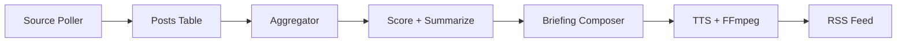

# AI Summary Podcast

Self-hosted pipeline that monitors content sources (RSS feeds, websites), filters and summarizes relevant content using an LLM, converts summaries to audio via TTS, and delivers them as a podcast feed consumable by any podcast app.

## How It Works



1. **Source Poller** — Periodically fetches new content from configured RSS feeds, websites, and X (Twitter) accounts. Individual items (tweets, RSS entries, scraped pages) are stored as **posts** in a dedicated table. Posts older than a configurable threshold (default 7 days) are automatically discarded.
2. **Aggregation** — At briefing generation time, unprocessed posts are aggregated into articles. For short-form sources (tweets, nitter feeds), multiple posts are merged into a single digest article. For long-form sources, each post maps 1:1 to an article. A `post_articles` join table maintains full traceability.
3. **LLM Processing** — Two sequential stages, each using a configurable model from the named model registry:
   - **Score + Summarize** — A single LLM call per article that scores relevance (0–10), filters out irrelevant content, and summarizes the relevant parts. Articles below the `relevanceThreshold` (default 5) are excluded.
   - **Briefing Composition** — Composes a coherent briefing script from all relevant articles with natural transitions.
4. **TTS Generation** — Converts the script to speech via OpenAI TTS, chunking at sentence boundaries and concatenating with FFmpeg.
5. **Podcast Feed** — Serves an RSS 2.0 feed with `<enclosure>` tags so any podcast app can subscribe.

Each user can create multiple podcasts, each with its own sources, topic, language, LLM models, TTS voice, style, and generation schedule (cron).

## Customizing Your Podcast

Each podcast can be tailored to your preferences via the following settings:

| Setting | Default | Description |
|---------|---------|-------------|
| `name` | — | Display name shown in your podcast app |
| `topic` | — | Interest area used by the LLM to filter relevant articles |
| `language` | `"en"` | Language for the briefing script, date formatting, and RSS feed metadata (56 languages supported) |
| `style` | `"news-briefing"` | Briefing tone — see styles below |
| `ttsVoice` | `"nova"` | OpenAI TTS voice (`alloy`, `echo`, `fable`, `nova`, `onyx`, `shimmer`) |
| `ttsSpeed` | `1.0` | TTS playback speed multiplier (e.g. `1.5` for faster speech) |
| `llmModels` | — | Override the LLM models per pipeline stage — see [Model Configuration](#model-configuration) below |
| `targetWords` | `1500` | Approximate word count for the briefing script |
| `cron` | `"0 0 6 * * *"` | Generation schedule in cron format (default: daily at 6 AM) |
| `customInstructions` | — | Free-form instructions appended to the LLM prompt (e.g. "Focus on recent breakthroughs" or "Avoid financial topics") |
| `relevanceThreshold` | `5` | Minimum relevance score (0–10) for an article to be included in the briefing |
| `requireReview` | `false` | When `true`, generated scripts pause for review before TTS — see [Episode Review](#episode-review) below |

### Briefing Styles

| Style | Tone |
|-------|------|
| `news-briefing` | Professional news anchor — structured, authoritative, smooth transitions |
| `casual` | Friendly podcast host — conversational, relaxed, like talking to a friend |
| `deep-dive` | Analytical exploration — in-depth analysis and thoughtful commentary |
| `executive-summary` | Concise and fact-focused — minimal commentary, straight to the point |

### Language Support

Briefings can be generated in any of 56 languages. Set the `language` field to a language code when creating or updating a podcast:

`af`, `ar`, `hy`, `az`, `be`, `bs`, `bg`, `ca`, `zh`, `hr`, `cs`, `da`, `nl`, `en`, `et`, `fi`, `fr`, `gl`, `de`, `el`, `he`, `hi`, `hu`, `is`, `id`, `it`, `ja`, `kn`, `kk`, `ko`, `lv`, `lt`, `mk`, `ms`, `mr`, `mi`, `ne`, `no`, `fa`, `pl`, `pt`, `ro`, `ru`, `sr`, `sk`, `sl`, `es`, `sw`, `sv`, `tl`, `ta`, `th`, `tr`, `uk`, `ur`, `vi`, `cy`

The language setting affects the LLM script generation, date formatting in the briefing, and the `<language>` element in the RSS feed.

### Model Configuration

The LLM pipeline uses a **named model registry** defined in `application.yaml`. Each entry maps a name to a provider and model ID:

```yaml
app:
  llm:
    models:
      cheap:
        provider: openrouter
        model: openai/gpt-4o-mini
      capable:
        provider: openrouter
        model: anthropic/claude-sonnet-4.5
      local:
        provider: ollama
        model: llama3
    defaults:
      filter: cheap      # used for scoring and summarization
      compose: capable    # used for briefing composition
```

Per-podcast overrides use the `llmModels` field, mapping stage names (`filter`, `compose`) to model names from the registry:

```json
{
  "llmModels": {
    "filter": "local",
    "compose": "capable"
  }
}
```

### Episode Review

When `requireReview` is enabled on a podcast, the generation pipeline pauses after the LLM produces a script — no audio is generated yet. This lets you review, edit, or discard the script before committing to TTS costs.

The episode workflow is: `PENDING_REVIEW` → (edit script if needed) → `APPROVED` → TTS runs → `GENERATED`. You can also discard an episode to skip it entirely.

### Cost Tracking

Episode responses include token usage and estimated costs for both LLM and TTS stages. Costs are reported in USD cents and require pricing configuration in `application.yaml`:

```yaml
app:
  llm:
    models:
      cheap:
        input-cost-per-mtok: 0.15    # USD per million input tokens
        output-cost-per-mtok: 0.60   # USD per million output tokens
  tts:
    cost-per-million-chars: 15.00    # USD per million characters
```

Cost fields are `null` when pricing is not configured or when usage metadata is unavailable from the provider.

### Static Feed Export

After each feed-changing event (episode generation, approval, or cleanup), the system writes a `feed.xml` file to the podcast's episode directory (`data/episodes/{podcastId}/feed.xml`). This lets you host the entire directory on a static file server (S3, Nginx, GitHub Pages) without running the application.

To use a different base URL for the static feed's enclosure links (e.g., your CDN), set:

```yaml
app:
  feed:
    static-base-url: https://cdn.example.com
```

When not set, the static feed uses the same `app.feed.base-url` as the dynamic endpoint. The dynamic HTTP feed at `/users/{userId}/podcasts/{podcastId}/feed.xml` remains available regardless.

### Publishing to SoundCloud

Episodes can be published to SoundCloud after generation. This requires a SoundCloud OAuth app and a connected user account.

1. **Register a SoundCloud app** at https://soundcloud.com/you/apps (must be logged in). Set the redirect URI to `http://localhost:8080/oauth/soundcloud/callback`.

2. **Add credentials** to your `.env` file:

```
APP_SOUNDCLOUD_CLIENT_ID=<your-soundcloud-client-id>
APP_SOUNDCLOUD_CLIENT_SECRET=<your-soundcloud-client-secret>
```

3. **Restart the app** so it picks up the new environment variables.

4. **Connect your SoundCloud account** via the OAuth flow:

```bash
# Get the authorization URL
curl http://localhost:8080/users/{userId}/oauth/soundcloud/authorize
# → returns { "authorizationUrl": "https://secure.soundcloud.com/authorize?..." }

# Open the URL in a browser, log in and authorize the app
# The callback completes automatically and stores your tokens

# Verify the connection
curl http://localhost:8080/users/{userId}/oauth/soundcloud/status
```

5. **Publish an episode** (must be in `GENERATED` status):

```bash
curl -X POST http://localhost:8080/users/{userId}/podcasts/{podcastId}/episodes/{episodeId}/publish/soundcloud
```

The track is uploaded with the podcast name + date as title, a description from the script, and tags from the podcast topic. Episodes are automatically grouped into a SoundCloud playlist per podcast — on first publish a new playlist is created, and subsequent episodes are added to it. Publication status (PENDING, PUBLISHED, FAILED) is tracked per episode and target.

### Monitoring X (Twitter) Accounts

X accounts can be added as content sources so their posts are included in podcast briefings. This requires an X developer app and a connected user account.

1. **Register an X app** at https://developer.x.com/en/portal/dashboard. Enable OAuth 2.0 with type "Web App" and set the redirect URI to `http://localhost:8080/oauth/x/callback`. Requires at least the Basic tier ($100/month).

2. **Add credentials** to your `.env` file:

```
APP_X_CLIENT_ID=<your-x-client-id>
APP_X_CLIENT_SECRET=<your-x-client-secret>
```

3. **Restart the app** so it picks up the new environment variables.

4. **Connect your X account** via the OAuth flow:

```bash
# Get the authorization URL
curl http://localhost:8080/users/{userId}/oauth/x/authorize
# → returns { "authorizationUrl": "https://twitter.com/i/oauth2/authorize?..." }

# Open the URL in a browser, log in and authorize the app
# The callback completes automatically and stores your tokens

# Verify the connection
curl http://localhost:8080/users/{userId}/oauth/x/status
```

5. **Add an X source** to a podcast:

```bash
curl -X POST http://localhost:8080/users/{userId}/podcasts/{podcastId}/sources \
  -H 'Content-Type: application/json' \
  -d '{"type": "twitter", "url": "elonmusk", "pollIntervalMinutes": 60}'
```

The `url` field accepts a plain username (e.g., `elonmusk`), `@username`, or a full URL (e.g., `https://x.com/elonmusk`). Posts are polled on the configured interval and included in briefings. X tokens are automatically refreshed (they expire every 2 hours).

### Example: Create a Customized Podcast

```bash
curl -X POST http://localhost:8080/users/{userId}/podcasts \
  -H 'Content-Type: application/json' \
  -d '{
    "name": "AI Weekly",
    "topic": "artificial intelligence and machine learning",
    "language": "en",
    "style": "deep-dive",
    "llmModels": {"filter": "cheap", "compose": "capable"},
    "ttsVoice": "onyx",
    "ttsSpeed": 1.1,
    "targetWords": 2000,
    "relevanceThreshold": 6,
    "requireReview": true,
    "cron": "0 0 8 * * MON",
    "customInstructions": "Focus on recent breakthroughs and industry trends"
  }'
```

## API Overview

### Users

```
POST   /users                                        — Create a user
GET    /users                                        — List all users
GET    /users/{userId}                               — Get user
PUT    /users/{userId}                               — Update user
DELETE /users/{userId}                               — Delete user (cascades)
```

### Podcasts

```
POST   /users/{userId}/podcasts                      — Create a podcast
GET    /users/{userId}/podcasts                      — List podcasts
GET    /users/{userId}/podcasts/{podcastId}          — Get podcast
PUT    /users/{userId}/podcasts/{podcastId}          — Update podcast
DELETE /users/{userId}/podcasts/{podcastId}          — Delete podcast (cascades)
POST   /users/{userId}/podcasts/{podcastId}/generate — Manually trigger episode generation
GET    /users/{userId}/podcasts/{podcastId}/feed.xml — RSS 2.0 feed for podcast apps
```

### Episodes

```
GET    /users/{userId}/podcasts/{podcastId}/episodes              — List episodes (optional ?status= filter)
GET    /users/{userId}/podcasts/{podcastId}/episodes/{episodeId}  — Get episode (includes cost tracking fields)
PUT    /users/{userId}/podcasts/{podcastId}/episodes/{episodeId}/script  — Edit script (PENDING_REVIEW only)
POST   /users/{userId}/podcasts/{podcastId}/episodes/{episodeId}/approve — Approve and trigger TTS generation
POST   /users/{userId}/podcasts/{podcastId}/episodes/{episodeId}/discard — Discard episode
```

Episode statuses: `PENDING_REVIEW` → `APPROVED` → `GENERATED` (or `FAILED`). Episodes can also be `DISCARDED`. The review endpoints are only relevant when `requireReview` is enabled on the podcast.

### Sources

```
POST   /users/{userId}/podcasts/{podcastId}/sources             — Add source
GET    /users/{userId}/podcasts/{podcastId}/sources             — List sources
PUT    /users/{userId}/podcasts/{podcastId}/sources/{sourceId}  — Update source
DELETE /users/{userId}/podcasts/{podcastId}/sources/{sourceId}  — Delete source
```

Sources can be of type `rss`, `website`, or `twitter`. Each source has a configurable `pollIntervalMinutes` and can be toggled with `enabled`. Twitter sources require an X OAuth connection (see below). An optional `aggregate` field (boolean) controls whether posts are merged into a single digest article at briefing generation time — useful for short-form sources like tweets. When `null` (default), aggregation is auto-detected for `twitter` type sources and nitter.net RSS feeds.

Posts older than `app.source.max-article-age-days` (default: 7) are skipped during ingestion and periodically cleaned up. This prevents stale content from appearing in briefings when adding a new source with a large backlog.

### Publishing

```
POST   /users/{userId}/podcasts/{podcastId}/episodes/{episodeId}/publish/{target} — Publish episode to target
GET    /users/{userId}/podcasts/{podcastId}/episodes/{episodeId}/publications     — List publications for episode
```

### SoundCloud OAuth

```
GET    /users/{userId}/oauth/soundcloud/authorize  — Get SoundCloud authorization URL
GET    /oauth/soundcloud/callback                  — OAuth callback (handled automatically)
GET    /users/{userId}/oauth/soundcloud/status      — Check connection status
DELETE /users/{userId}/oauth/soundcloud             — Disconnect SoundCloud
```

### X (Twitter) OAuth

```
GET    /users/{userId}/oauth/x/authorize  — Get X authorization URL
GET    /oauth/x/callback                  — OAuth callback (handled automatically)
GET    /users/{userId}/oauth/x/status      — Check connection status
DELETE /users/{userId}/oauth/x             — Disconnect X account
```

### Provider Configuration

```
GET    /users/{userId}/api-keys              — List configured providers
PUT    /users/{userId}/api-keys/{category}   — Set provider (LLM or TTS)
DELETE /users/{userId}/api-keys/{category}   — Remove provider config
```

Users can configure their own LLM and TTS providers. Supported LLM providers: `openrouter`, `openai`, `ollama`. Supported TTS provider: `openai`. API keys are stored encrypted (AES-256).

## Prerequisites

- Java 24+
- FFmpeg (for audio concatenation and duration detection)
- An LLM provider — one of:
  - [OpenRouter](https://openrouter.ai/) API key (cloud, multiple models)
  - [Ollama](https://ollama.com/) running locally (free, no API key needed)
- An [OpenAI](https://platform.openai.com/) API key (TTS)

## Setup

1. Create a `.env` file in the project root:

```
APP_ENCRYPTION_MASTER_KEY=<base64-encoded 256-bit AES key>
OPENROUTER_API_KEY=<your-openrouter-key>
OPENAI_API_KEY=<your-openai-key>
```

Generate an encryption key: `openssl rand -base64 32`

`APP_ENCRYPTION_MASTER_KEY` is required. `OPENROUTER_API_KEY` and `OPENAI_API_KEY` serve as global fallbacks for LLM and TTS respectively — they are used when a user has not configured their own provider keys via the API. Users can override these by setting per-user provider configs. `APP_SOUNDCLOUD_CLIENT_ID` and `APP_SOUNDCLOUD_CLIENT_SECRET` are optional — only needed if you want to publish episodes to SoundCloud. `APP_X_CLIENT_ID` and `APP_X_CLIENT_SECRET` are optional — only needed if you want to poll X (Twitter) accounts as content sources (requires an [X Developer](https://developer.x.com/) Basic tier account).

### Using Ollama instead of OpenRouter

To use [Ollama](https://ollama.com/) as the LLM provider, start Ollama locally and pull a model:

```bash
ollama pull llama3
```

Then configure a user's LLM provider to use Ollama (no API key needed):

```bash
curl -X PUT http://localhost:8080/users/{userId}/api-keys/LLM \
  -H 'Content-Type: application/json' \
  -d '{"provider": "ollama"}'
```

This uses the default Ollama base URL (`http://localhost:11434`). You can omit `OPENROUTER_API_KEY` from `.env` if all users are configured with Ollama.

2. Start the application:

```bash
./start.sh        # runs in background, logs to app.log
./stop.sh          # graceful stop with 10s timeout
```

Or run directly:

```bash
source .env && ./mvnw spring-boot:run
```

The app starts on `http://localhost:8080`. Data is stored in `./data/` (SQLite DB + episode audio files).

## Running Tests

```bash
./mvnw test
```

Tests use [MockK](https://mockk.io/) for mocking.