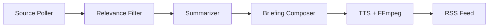

# AI Summary Podcast

Self-hosted pipeline that monitors content sources (RSS feeds, websites), filters and summarizes relevant content using an LLM, converts summaries to audio via TTS, and delivers them as a podcast feed consumable by any podcast app.

## How It Works



1. **Source Poller** — Periodically fetches new content from configured RSS feeds and websites.
2. **LLM Processing** — Filters articles for relevance, summarizes each one, and composes a briefing script. Uses an OpenAI-compatible API (e.g. OpenRouter).
3. **TTS Generation** — Converts the script to speech via OpenAI TTS, chunking at sentence boundaries and concatenating with FFmpeg.
4. **Podcast Feed** — Serves an RSS 2.0 feed with `<enclosure>` tags so any podcast app can subscribe.

Each user can create multiple podcasts, each with its own sources, topic, language, LLM model, TTS voice, style, and generation schedule (cron).

## Customizing Your Podcast

Each podcast can be tailored to your preferences via the following settings:

| Setting | Default | Description |
|---------|---------|-------------|
| `name` | — | Display name shown in your podcast app |
| `topic` | — | Interest area used by the LLM to filter relevant articles |
| `language` | `"en"` | Language for the briefing script, date formatting, and RSS feed metadata (56 languages supported) |
| `style` | `"news-briefing"` | Briefing tone — see styles below |
| `ttsVoice` | `"nova"` | OpenAI TTS voice (`alloy`, `echo`, `fable`, `nova`, `onyx`, `shimmer`) |
| `ttsSpeed` | `1.0` | TTS playback speed multiplier (e.g. `1.5` for faster speech) |
| `llmModel` | — | Override the LLM model used for script composition (e.g. `gpt-4o`, `claude-3-sonnet`) |
| `targetWords` | `1500` | Approximate word count for the briefing script |
| `cron` | `"0 0 6 * * *"` | Generation schedule in cron format (default: daily at 6 AM) |
| `customInstructions` | — | Free-form instructions appended to the LLM prompt (e.g. "Focus on recent breakthroughs" or "Avoid financial topics") |

### Briefing Styles

| Style | Tone |
|-------|------|
| `news-briefing` | Professional news anchor — structured, authoritative, smooth transitions |
| `casual` | Friendly podcast host — conversational, relaxed, like talking to a friend |
| `deep-dive` | Analytical exploration — in-depth analysis and thoughtful commentary |
| `executive-summary` | Concise and fact-focused — minimal commentary, straight to the point |

### Language Support

Briefings can be generated in any of 56 languages. Set the `language` field to a language code when creating or updating a podcast:

`af`, `ar`, `hy`, `az`, `be`, `bs`, `bg`, `ca`, `zh`, `hr`, `cs`, `da`, `nl`, `en`, `et`, `fi`, `fr`, `gl`, `de`, `el`, `he`, `hi`, `hu`, `is`, `id`, `it`, `ja`, `kn`, `kk`, `ko`, `lv`, `lt`, `mk`, `ms`, `mr`, `mi`, `ne`, `no`, `fa`, `pl`, `pt`, `ro`, `ru`, `sr`, `sk`, `sl`, `es`, `sw`, `sv`, `tl`, `ta`, `th`, `tr`, `uk`, `ur`, `vi`, `cy`

The language setting affects the LLM script generation, date formatting in the briefing, and the `<language>` element in the RSS feed.

### Example: Create a Customized Podcast

```bash
curl -X POST http://localhost:8080/users/{userId}/podcasts \
  -H 'Content-Type: application/json' \
  -d '{
    "name": "AI Weekly",
    "topic": "artificial intelligence and machine learning",
    "language": "en",
    "style": "deep-dive",
    "ttsVoice": "onyx",
    "ttsSpeed": 1.1,
    "targetWords": 2000,
    "cron": "0 0 8 * * MON",
    "customInstructions": "Focus on recent breakthroughs and industry trends"
  }'
```

## API Overview

### Users

```
POST   /users                                        — Create a user
GET    /users                                        — List all users
GET    /users/{userId}                               — Get user
PUT    /users/{userId}                               — Update user
DELETE /users/{userId}                               — Delete user (cascades)
```

### Podcasts

```
POST   /users/{userId}/podcasts                      — Create a podcast
GET    /users/{userId}/podcasts                      — List podcasts
GET    /users/{userId}/podcasts/{podcastId}          — Get podcast
PUT    /users/{userId}/podcasts/{podcastId}          — Update podcast
DELETE /users/{userId}/podcasts/{podcastId}          — Delete podcast (cascades)
POST   /users/{userId}/podcasts/{podcastId}/generate — Manually trigger episode generation
GET    /users/{userId}/podcasts/{podcastId}/feed.xml — RSS 2.0 feed for podcast apps
```

### Sources

```
POST   /users/{userId}/podcasts/{podcastId}/sources             — Add source
GET    /users/{userId}/podcasts/{podcastId}/sources             — List sources
PUT    /users/{userId}/podcasts/{podcastId}/sources/{sourceId}  — Update source
DELETE /users/{userId}/podcasts/{podcastId}/sources/{sourceId}  — Delete source
```

Sources can be of type `rss` or `website`. Each source has a configurable `pollIntervalMinutes` and can be toggled with `enabled`.

### Provider Configuration

```
GET    /users/{userId}/api-keys              — List configured providers
PUT    /users/{userId}/api-keys/{category}   — Set provider (LLM or TTS)
DELETE /users/{userId}/api-keys/{category}   — Remove provider config
```

Users can configure their own LLM and TTS providers. Supported LLM providers: `openrouter`, `openai`, `ollama`. Supported TTS provider: `openai`. API keys are stored encrypted (AES-256).

## Prerequisites

- Java 24+
- FFmpeg (for audio concatenation and duration detection)
- An LLM provider — one of:
  - [OpenRouter](https://openrouter.ai/) API key (cloud, multiple models)
  - [Ollama](https://ollama.com/) running locally (free, no API key needed)
- An [OpenAI](https://platform.openai.com/) API key (TTS)

## Setup

1. Create a `.env` file in the project root:

```
APP_ENCRYPTION_MASTER_KEY=<base64-encoded 256-bit AES key>
OPENROUTER_API_KEY=<your-openrouter-key>
OPENAI_API_KEY=<your-openai-key>
```

Generate an encryption key: `openssl rand -base64 32`

`APP_ENCRYPTION_MASTER_KEY` is required. `OPENROUTER_API_KEY` and `OPENAI_API_KEY` serve as global fallbacks for LLM and TTS respectively — they are used when a user has not configured their own provider keys via the API. Users can override these by setting per-user provider configs.

### Using Ollama instead of OpenRouter

To use [Ollama](https://ollama.com/) as the LLM provider, start Ollama locally and pull a model:

```bash
ollama pull llama3
```

Then configure a user's LLM provider to use Ollama (no API key needed):

```bash
curl -X PUT http://localhost:8080/users/{userId}/api-keys/LLM \
  -H 'Content-Type: application/json' \
  -d '{"provider": "ollama"}'
```

This uses the default Ollama base URL (`http://localhost:11434`). You can omit `OPENROUTER_API_KEY` from `.env` if all users are configured with Ollama.

2. Start the application:

```bash
./start.sh        # runs in background, logs to app.log
./stop.sh          # graceful stop with 10s timeout
```

Or run directly:

```bash
source .env && ./mvnw spring-boot:run
```

The app starts on `http://localhost:8080`. Data is stored in `./data/` (SQLite DB + episode audio files).

## Running Tests

```bash
./mvnw test
```

Tests use [MockK](https://mockk.io/) for mocking.