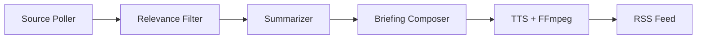

# AI Summary Podcast

Self-hosted pipeline that monitors content sources (RSS feeds, websites), filters and summarizes relevant content using an LLM, converts summaries to audio via TTS, and delivers them as a podcast feed consumable by any podcast app.

## How It Works



1. **Source Poller** — Periodically fetches new content from configured RSS feeds and websites.
2. **LLM Processing** — Filters articles for relevance, summarizes each one, and composes a briefing script. Uses an OpenAI-compatible API (e.g. OpenRouter).
3. **TTS Generation** — Converts the script to speech via OpenAI TTS, chunking at sentence boundaries and concatenating with FFmpeg.
4. **Podcast Feed** — Serves an RSS 2.0 feed with `<enclosure>` tags so any podcast app can subscribe.

Each user can create multiple podcasts, each with its own sources, topic, LLM model, TTS voice, style, and generation schedule (cron).

## Prerequisites

- Java 24+
- FFmpeg (for audio concatenation and duration detection)
- An [OpenRouter](https://openrouter.ai/) API key (LLM)
- An [OpenAI](https://platform.openai.com/) API key (TTS)

## Setup

1. Create a `.env` file in the project root:

```
APP_ENCRYPTION_MASTER_KEY=<base64-encoded 256-bit AES key>
OPENROUTER_API_KEY=<your-openrouter-key>
OPENAI_API_KEY=<your-openai-key>
```

Generate an encryption key: `openssl rand -base64 32`

`APP_ENCRYPTION_MASTER_KEY` is required. `OPENROUTER_API_KEY` and `OPENAI_API_KEY` serve as global fallbacks for LLM and TTS respectively — they are used when a user has not configured their own provider keys via the API. Users can override these by setting per-user provider configs.

2. Start the application:

```bash
./start.sh        # runs in background, logs to app.log
./stop.sh          # graceful stop with 10s timeout
```

Or run directly:

```bash
source .env && ./mvnw spring-boot:run
```

The app starts on `http://localhost:8080`. Data is stored in `./data/` (SQLite DB + episode audio files).

## Running Tests

```bash
./mvnw test
```

Tests use [MockK](https://mockk.io/) for mocking.
