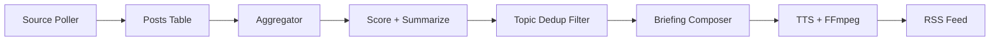

# AI Summary Podcast

Self-hosted pipeline that monitors content sources (RSS feeds, websites), filters and summarizes relevant content using an LLM, converts summaries to audio via TTS, and delivers them as a podcast feed consumable by any podcast app.

## How It Works


```mermaid
flowchart LR
    A[Source Poller] --> B[Posts Table]
    B --> C[Aggregator]
    C --> D[Score + Summarize]
    D --> E[Topic Dedup Filter]
    E --> F[Briefing Composer]
    F --> G[TTS + FFmpeg]
    G --> H[RSS Feed]
```

1. **Source Poller** — Periodically fetches new content from configured RSS feeds, websites, and X (Twitter) accounts. Individual items (tweets, RSS entries, scraped pages) are stored as **posts** in a dedicated table. Posts older than a configurable threshold (default 7 days) are automatically discarded.
2. **Aggregation** — At briefing generation time, unprocessed posts are aggregated into articles. For short-form sources (tweets, nitter feeds), multiple posts are merged into a single digest article. For long-form sources, each post maps 1:1 to an article. A `post_articles` join table maintains full traceability.
3. **LLM Processing** — Three sequential stages, each using a configurable model from the named model registry:
   - **Score + Summarize** — A single LLM call per article that scores relevance (0–10), filters out irrelevant content, and summarizes the relevant parts. Summary length scales with article length: short articles get 2–3 sentences, medium articles 4–6 sentences, and long articles a full paragraph. Articles below the `relevanceThreshold` (default 5) are excluded.
   - **Topic Dedup Filter** — Clusters candidate articles by topic, compares against articles from recent episodes, and filters out duplicates. For each topic: NEW topics pass through (top 3 articles per cluster), CONTINUATION topics with genuinely new developments are kept with `[FOLLOW-UP]` context annotations, and topics already fully covered are skipped. An age gate also excludes articles older than the latest published episode, preventing old content from new sources from flooding in.
   - **Briefing Composition** — Composes a coherent briefing script from the filtered articles with natural transitions. When few articles are available (below `fullBodyThreshold`, default 5), full article bodies are used instead of summaries for richer content. Continuation topics receive `[FOLLOW-UP]` annotations so the composer can naturally reference previous coverage.
4. **TTS Generation** — Converts the script to speech via OpenAI TTS, ElevenLabs, or Inworld AI, chunking at sentence boundaries and concatenating with FFmpeg. ElevenLabs and Inworld support multi-speaker dialogue and interview styles. Each TTS provider can inject provider-specific script guidelines into the LLM prompt (e.g. Inworld's expressiveness markup). After each episode is saved, a short recap is generated and stored for use as the episode description in publication targets (feed.xml, SoundCloud).
5. **Podcast Feed** — Serves an RSS 2.0 feed with iTunes metadata (`itunes:type`, `itunes:category`, `itunes:explicit`, `itunes:duration`, `itunes:image`, `atom:link` self-reference) and rich `content:encoded` show notes. Episode show notes list topics covered with clickable links to representative source articles, grouped by the dedup filter's topic clusters. A link to the full sources page and a contact email footer are included.

Each user can create multiple podcasts, each with its own sources, topic, language, LLM models, TTS provider/voices, style, and generation schedule (cron).

## Prerequisites

- Java 24+ (Java 25+ requires `--enable-native-access=ALL-UNNAMED` for the SQLite JDBC driver — `start.sh` and `mvnw spring-boot:run` handle this automatically)
- FFmpeg (for audio concatenation and duration detection)
- An LLM provider — one of:
  - [OpenRouter](https://openrouter.ai/) API key (cloud, multiple models)
  - [Ollama](https://ollama.com/) running locally (free, no API key needed)
- A TTS provider — one of:
  - [OpenAI](https://platform.openai.com/) API key (default)
  - [ElevenLabs](https://elevenlabs.io/) API key (for advanced voices and multi-speaker dialogue)
  - [Inworld AI](https://inworld.ai/tts) API key (for expressive voices with rich markup support)

## Setup

1. Install [direnv](https://direnv.net/) and hook it into your shell (e.g. `eval "$(direnv hook zsh)"` in `~/.zshrc`).

2. Create a `.envrc` file in the project root:

```bash
export APP_ENCRYPTION_MASTER_KEY=<base64-encoded 256-bit AES key>
```

3. Allow the file: `direnv allow`

Generate an encryption key: `openssl rand -base64 32`

`APP_ENCRYPTION_MASTER_KEY` is the only required environment variable. It is used to encrypt API keys stored in the database.

All other credentials (LLM providers, TTS providers, publishing targets) are managed per-user via the web dashboard or the [Provider Configuration API](#provider-configuration). Optionally, you can set environment variables as global fallbacks for users who haven't configured their own keys:

| Variable | Purpose |
|----------|---------|
| `OPENROUTER_API_KEY` | Global fallback for OpenRouter LLM provider |
| `OPENAI_API_KEY` | Global fallback for OpenAI TTS provider |
| `ELEVENLABS_API_KEY` | Global fallback for ElevenLabs TTS provider |
| `APP_SOUNDCLOUD_CLIENT_ID` / `APP_SOUNDCLOUD_CLIENT_SECRET` | SoundCloud OAuth app credentials (see [Publishing to SoundCloud](#publishing-to-soundcloud)) |
| `APP_X_CLIENT_ID` / `APP_X_CLIENT_SECRET` | X (Twitter) OAuth app credentials (see [Monitoring X Accounts](#monitoring-x-twitter-accounts)) |

> **Without direnv?** You can alternatively export the variables in your shell profile (e.g. `~/.zshenv`) or source a `.env` file manually before running the app.

### Provider Configuration

LLM and TTS providers are configured per-user via the **web dashboard** (Settings > API Keys) or the [Provider Configuration API](#provider-configuration). Supported providers:

- **LLM**: `openrouter` (default), `openai`, `ollama`
- **TTS**: `openai` (default), `elevenlabs`, `inworld`

**Using Ollama (local, free):** Start [Ollama](https://ollama.com/) locally, pull a model (`ollama pull llama3`), then configure it as your LLM provider in the dashboard or via the API. No API key needed, uses `http://localhost:11434/v1` by default.

**Using ElevenLabs for TTS:** [ElevenLabs](https://elevenlabs.io/) supports high-quality voices and multi-speaker dialogue/interview styles. Configure it as your TTS provider in the dashboard with your API key, then use `GET /users/{userId}/voices?provider=elevenlabs` to discover available voice IDs.

### Starting the Application

```bash
./start.sh        # runs in background, logs to app.log
./stop.sh          # graceful stop with 10s timeout
```

Or run directly (environment variables are loaded automatically by direnv):

```bash
./mvnw spring-boot:run
```

The app starts on `http://localhost:8085`. Data is stored in `./data/` (SQLite DB + episode audio files).

### Web Dashboard

A Next.js dashboard is available in `frontend/` for visual management of podcasts, episodes, and publications.

```bash
cd frontend && npm run dev
```

The dashboard provides:
- **User settings** — gear icon in the header opens a settings page to edit your profile name and manage API keys (LLM and TTS provider configs) with a wizard-style dialog. All API keys are stored encrypted
- **Podcast overview** — browse all podcasts with style badges, topics, and quick-access settings gear icon
- **Podcast settings** — edit all podcast configuration (general, LLM, TTS, content, publishing) via a tabbed settings page with provider/model dropdowns for LLM and TTS selection
- **Episode management** — view episodes with status filtering, approve/discard/regenerate pending reviews. Click any episode row to open the detail page. Shows the generation schedule in human-readable form
- **Episode detail page** — dedicated page per episode with tabs for Script (chat-bubble rendering), Articles (grouped by source with relevance scores and collapsible sections), and Publications. Shows episode metadata, recap, and contextual action buttons
- **Upcoming episode preview** — see collected articles for the next episode, preview the script via Server-Sent Events with real-time progress stages (aggregating, scoring, deduplicating, composing), and trigger episode generation on demand. Shows next scheduled generation time
- **Source export** — download all configured sources as a markdown file from the Sources tab
- **Publish wizard** — publish generated episodes to FTP or SoundCloud via a step-by-step wizard with automatic quota detection and recovery (re-authorize on OAuth expiry, remove oldest track on quota exceeded)
- **Publications tab** — view all publications with track/playlist links, republish with confirmation

The frontend proxies API calls to `http://localhost:8085` via Next.js rewrites.

## Customizing Your Podcast

Each podcast can be tailored to your preferences via the following settings:

| Setting | Default | Description |
|---------|---------|-------------|
| `name` | — | Display name shown in your podcast app |
| `topic` | — | Interest area used by the LLM to filter relevant articles |
| `language` | `"en"` | Language for the briefing script, date formatting, and RSS feed metadata (actual audio language support depends on TTS provider) |
| `style` | `"news-briefing"` | Briefing tone — see styles below |
| `ttsProvider` | `"openai"` | TTS provider (`openai`, `elevenlabs`, or `inworld`) |
| `ttsVoices` | `{"default": "nova"}` | Voice configuration — see [TTS Configuration](#tts-configuration) below |
| `speakerNames` | `null` | Display names for speakers — e.g. `{"interviewer": "Alice", "expert": "Bob"}`. Used in dialogue/interview scripts so speakers address each other by name |
| `ttsSettings` | — | Provider-specific settings (e.g. `{"speed": "1.25"}` for OpenAI, `{"stability": "0.5"}` for ElevenLabs, `{"model": "inworld-tts-1.5-max", "speed": "1.0", "temperature": "1.1"}` for Inworld) |
| `llmModels` | — | Override LLM models per stage with `{provider, model}` objects — see [Model Configuration](#model-configuration) |
| `targetWords` | `1500` | Approximate word count for the briefing script |
| `cron` | `"0 0 6 * * *"` | Generation schedule in cron format (default: daily at 6 AM) |
| `customInstructions` | — | Free-form instructions appended to the LLM prompt (e.g. "Focus on recent breakthroughs" or "Avoid financial topics") |
| `relevanceThreshold` | `5` | Minimum relevance score (0–10) for an article to be included in the briefing |
| `fullBodyThreshold` | `5` | When the number of relevant articles is below this threshold, the composer uses full article bodies instead of summaries for richer content |
| `requireReview` | `false` | When `true`, generated scripts pause for review before TTS — see [Episode Review](#episode-review) below |
| `maxLlmCostCents` | `null` | Per-podcast LLM cost threshold in cents — see [Cost Gate](#cost-gate) below |
| `maxArticleAgeDays` | `null` | Maximum age of articles to include (default: 7 days). Articles older than this are skipped during ingestion |
| `sponsor` | `null` | Sponsor configuration — e.g. `{"name": "Acme Corp", "message": "building the future"}`. Adds a sponsor message after the introduction and in the sign-off |
| `pronunciations` | `null` | IPA pronunciation dictionary — maps terms to phonemes (e.g. `{"Anthropic": "/ænˈθɹɒpɪk/"}`) for correct TTS pronunciation. Currently supported by Inworld TTS |
| `recapLookbackEpisodes` | `null` | Number of recent episodes to check for topic overlap (default: 7). The dedup filter uses article titles and summaries from these episodes to prevent repeating previously covered topics |

### Briefing Styles

| Style | Tone |
|-------|------|
| `news-briefing` | Professional news anchor — structured, authoritative, smooth transitions |
| `casual` | Friendly podcast host — conversational, relaxed, like talking to a friend |
| `deep-dive` | Analytical exploration — in-depth analysis and thoughtful commentary |
| `executive-summary` | Concise and fact-focused — minimal commentary, straight to the point |
| `dialogue` | Multi-speaker conversation — requires ElevenLabs or Inworld TTS and at least two voice roles |
| `interview` | Interviewer/expert conversation — asymmetric roles (~35% interviewer, ~65% expert). Features "coming up" topic teasers (5+ articles), strategic cliffhangers, spontaneous interruptions (excited, skeptical, confused, connecting dots, disagreement), and strict 3-4 sentence expert turn limits. Requires ElevenLabs or Inworld TTS with exactly `interviewer` and `expert` voice roles |

### TTS Configuration

Three TTS providers are supported: **OpenAI** (default), **ElevenLabs**, and **Inworld AI**. Configure your preferred provider and API key via the web dashboard (Settings > API Keys) or the [Provider Configuration API](#provider-configuration).

**OpenAI** — Voices: `alloy`, `echo`, `fable`, `nova`, `onyx`, `shimmer`. Settings: `{"speed": "1.25"}`.

**ElevenLabs** — Supports single-voice monologue, multi-speaker dialogue, and interview styles. Use `GET /users/{userId}/voices?provider=elevenlabs` to discover available voice IDs.

**Inworld AI** — Requires JWT key and secret as `key:secret`. Supports monologue, dialogue, and interview styles with rich expressiveness markup (emphasis, non-verbal cues, IPA phonemes). Scripts are automatically post-processed to sanitize LLM output for Inworld. A per-podcast pronunciation dictionary (`pronunciations` field) can map terms to IPA phonemes. Models: `inworld-tts-1.5-max` (default), `inworld-tts-1.5-mini`. Settings: `{"model": "inworld-tts-1.5-max", "speed": "1.0", "temperature": "0.8"}`. Use `GET /users/{userId}/voices?provider=inworld` to discover available voice IDs.

Voice configuration uses the `ttsVoices` map:
- Monologue: `{"default": "nova"}` (or any ElevenLabs voice ID)
- Dialogue: `{"host": "<voice_id>", "cohost": "<voice_id>"}` — the key names become the speaker tags in the generated script
- Interview: `{"interviewer": "<voice_id>", "expert": "<voice_id>"}` — fixed role keys required for the interview style

### Model Configuration

All model definitions (LLM and TTS) live under `app.models` in `application.yaml`, organized by provider. Each model has a `type` (`llm` or `tts`) and optional cost fields:

```yaml
app:
  models:
    openrouter:
      "[openai/gpt-5.4-nano]":
        type: llm
        input-cost-per-mtok: 0.20
        output-cost-per-mtok: 1.25
      "[anthropic/claude-sonnet-4.6]":
        type: llm
        input-cost-per-mtok: 3.00
        output-cost-per-mtok: 15.00
    openai:
      "[tts-1-hd]":
        type: tts
        cost-per-million-chars: 15.00
    inworld:
      "[inworld-tts-1.5-max]":
        type: tts
        cost-per-million-chars: 10.00
  llm:
    defaults:
      filter:
        provider: openrouter
        model: openai/gpt-5.4-nano
      compose:
        provider: openrouter
        model: anthropic/claude-sonnet-4.6
```

Model name keys containing `/`, `-`, or `.` must be quoted with `"[...]"` for Spring Boot's relaxed property binding.

Per-podcast overrides use the `llmModels` field, mapping stage names (`filter`, `compose`) to `{provider, model}` objects:

```json
{
  "llmModels": {
    "compose": {"provider": "openrouter", "model": "anthropic/claude-opus-4.7"}
  }
}
```

The `GET /config/defaults` endpoint returns available models grouped by provider and type, used by the frontend to populate model selection dropdowns.

### Episode Review

When `requireReview` is enabled on a podcast, the generation pipeline pauses after the LLM produces a script — no audio is generated yet. This lets you review, edit, or discard the script before committing to TTS costs.

The episode workflow is: `PENDING_REVIEW` → (edit script if needed) → `APPROVED` → TTS runs → `GENERATED`. You can also discard an episode — discarding resets non-aggregated articles so they are included in the next generation run, while aggregated articles (from X/Nitter sources) are deleted so their posts get re-aggregated fresh with any new posts on the next run. Articles linked to published episodes are never reset or deleted during discard, preventing published content from being reprocessed.

Episodes can be **regenerated** — this re-composes the script from the same articles using the current podcast settings, creating a new episode. Regeneration is available for `PENDING_REVIEW` and `DISCARDED` episodes, and is blocked if any episode on the same day has already been published.

### Cost Tracking

Episode responses include token usage and estimated costs for both LLM and TTS stages. Costs are reported in USD cents and are derived from the pricing fields configured on each model in `app.models` (see [Model Configuration](#model-configuration)). LLM models use `input-cost-per-mtok` and `output-cost-per-mtok` (USD per million tokens). TTS models use `cost-per-million-chars` (USD per million characters).

Cost fields are `null` when pricing is not configured or when usage metadata is unavailable from the provider.

### Cost Gate

Before making any LLM API calls, the pipeline estimates the total cost (scoring + dedup filter + composition) and compares it against a configurable threshold. If the estimated cost exceeds the threshold, the entire pipeline run is skipped and a warning is logged.

The global default threshold is configured in `application.yaml`:

```yaml
app:
  llm:
    max-cost-cents: 200    # $2.00 — skip pipeline if estimated cost exceeds this
```

Each podcast can override the global threshold via `maxLlmCostCents`. When set to `null` (the default), the global value applies. The estimation is pessimistic — it assumes all articles pass relevance filtering — so actual costs will typically be lower than estimated. If model pricing is not configured, the cost gate is bypassed with a warning.

### Static Feed Export

After each feed-changing event (episode generation, approval, or cleanup), the system writes a `feed.xml` file to the podcast's episode directory (`data/episodes/{podcastId}/feed.xml`). This lets you host the entire directory on a static file server (S3, Nginx, GitHub Pages) without running the application.

To use a different base URL for the static feed's enclosure links (e.g., your CDN), set:

```yaml
app:
  feed:
    static-base-url: https://cdn.example.com
```

When not set, the static feed uses the same `app.feed.base-url` as the dynamic endpoint. The dynamic HTTP feed at `/users/{userId}/podcasts/{podcastId}/feed.xml` remains available regardless.

### Publishing

Episodes can be published to multiple targets after generation. Supported targets: **FTP** and **SoundCloud**. Publication targets are configured per-podcast via the API, and each episode tracks its publication status (PENDING, PUBLISHED, FAILED) independently per target. Episodes can also be unpublished from any target.

#### Publishing to FTP

FTP publishing uploads the episode audio file and updates the static feed.xml on a remote server. Configure an FTP publication target on a podcast:

```bash
curl -X PUT http://localhost:8085/users/{userId}/podcasts/{podcastId}/publication-targets/ftp \
  -H 'Content-Type: application/json' \
  -d '{
    "host": "ftp.example.com",
    "port": 21,
    "username": "user",
    "password": "pass",
    "useTls": true,
    "remotePath": "/podcast",
    "publicUrl": "https://podcast.example.com"
  }'
```

You can test the FTP connection before publishing:

```bash
curl -X POST http://localhost:8085/users/{userId}/publishing/test/ftp \
  -H 'Content-Type: application/json' \
  -d '{"host": "ftp.example.com", "port": 21, "username": "user", "password": "pass", "useTls": true}'
```

#### Publishing to SoundCloud

SoundCloud publishing requires a SoundCloud OAuth app and a connected user account.

1. **Register a SoundCloud app** at https://soundcloud.com/you/apps (you must be logged in to SoundCloud). During registration, set the **redirect URI** to match your app's base URL:

   ```
   http://localhost:8085/oauth/soundcloud/callback
   ```

   The redirect URI must exactly match the `app.feed.base-url` configured in `application.yaml` followed by `/oauth/soundcloud/callback`. If these don't match, you'll get a `redirect_uri_mismatch` error during authorization.

2. **Add credentials** to your `.envrc` file:

```bash
export APP_SOUNDCLOUD_CLIENT_ID=<your-soundcloud-client-id>
export APP_SOUNDCLOUD_CLIENT_SECRET=<your-soundcloud-client-secret>
```

   Then run `direnv allow` to reload.

3. **Restart the app** so it picks up the new environment variables.

4. **Connect your SoundCloud account** via the OAuth flow:

```bash
# Get the authorization URL
curl http://localhost:8085/users/{userId}/oauth/soundcloud/authorize
# → returns { "authorizationUrl": "https://secure.soundcloud.com/authorize?..." }

# Copy the authorizationUrl and open it in a browser
# Log in to SoundCloud and authorize the app
# The callback redirects back to your app and stores the tokens automatically

# Verify the connection
curl http://localhost:8085/users/{userId}/oauth/soundcloud/status
# → returns { "connected": true, ... }
```

5. **Publish an episode** (must be in `GENERATED` status):

```bash
curl -X POST http://localhost:8085/users/{userId}/podcasts/{podcastId}/episodes/{episodeId}/publish/soundcloud
```

The track is uploaded with the podcast name + date as title, a description from the script, and tags from the podcast topic. Episodes are automatically grouped into a SoundCloud playlist per podcast — on first publish a new playlist is created, and subsequent episodes are added to it. Publication status (PENDING, PUBLISHED, FAILED) is tracked per episode and target.

Before uploading, the system checks the SoundCloud upload quota. If the quota is exceeded, the publish wizard offers to remove the oldest app-uploaded track (filtered by podcast name) to free up space. If the OAuth token has expired, the wizard shows a re-authorize button.

To enable an RSS feed for your SoundCloud uploads, go to your SoundCloud **Settings > Content** tab, find your RSS feed URL, and enable **"Include in RSS feed"** under upload defaults. This lets podcast apps subscribe to your SoundCloud-hosted episodes directly.

### Monitoring X (Twitter) Accounts

X accounts can be added as content sources so their posts are included in podcast briefings. This requires an X developer app and a connected user account.

1. **Register an X app** at https://developer.x.com/en/portal/dashboard. Enable OAuth 2.0 with type "Web App" and set the redirect URI to `http://localhost:8085/oauth/x/callback`. Requires at least the Basic tier ($100/month).

2. **Add credentials** to your `.envrc` file:

```bash
export APP_X_CLIENT_ID=<your-x-client-id>
export APP_X_CLIENT_SECRET=<your-x-client-secret>
```

   Then run `direnv allow` to reload.

3. **Restart the app** so it picks up the new environment variables.

4. **Connect your X account** via the OAuth flow:

```bash
# Get the authorization URL
curl http://localhost:8085/users/{userId}/oauth/x/authorize
# → returns { "authorizationUrl": "https://twitter.com/i/oauth2/authorize?..." }

# Open the URL in a browser, log in and authorize the app
# The callback completes automatically and stores your tokens

# Verify the connection
curl http://localhost:8085/users/{userId}/oauth/x/status
```

5. **Add an X source** to a podcast:

```bash
curl -X POST http://localhost:8085/users/{userId}/podcasts/{podcastId}/sources \
  -H 'Content-Type: application/json' \
  -d '{"type": "twitter", "url": "elonmusk", "pollIntervalMinutes": 60}'
```

The `url` field accepts a plain username (e.g., `elonmusk`), `@username`, or a full URL (e.g., `https://x.com/elonmusk`). Posts are polled on the configured interval and included in briefings. X tokens are automatically refreshed (they expire every 2 hours).

### Using Nitter as an Alternative to X

If you don't have an X developer account, you can use [Nitter](https://nitter.net) as a free alternative. Nitter is an open-source front-end for Twitter that exposes public RSS feeds — no API key or OAuth setup required. Add a Nitter feed as a regular RSS source:

```bash
curl -X POST http://localhost:8085/users/{userId}/podcasts/{podcastId}/sources \
  -H 'Content-Type: application/json' \
  -d '{"type": "rss", "url": "https://nitter.net/elonmusk/rss", "pollIntervalMinutes": 60}'
```

Nitter sources are automatically detected for aggregation — individual tweets are merged into a single digest article at briefing time, just like native X sources. Note that Nitter coverage may not be fully on par with the X API (e.g., missing replies, retweets, or media context), but it works well for following public accounts without any paid API access.

### Example: Create a Customized Podcast

```bash
curl -X POST http://localhost:8085/users/{userId}/podcasts \
  -H 'Content-Type: application/json' \
  -d '{
    "name": "AI Weekly",
    "topic": "artificial intelligence and machine learning",
    "language": "en",
    "style": "deep-dive",
    "llmModels": {"compose": {"provider": "openrouter", "model": "anthropic/claude-opus-4.7"}},
    "ttsProvider": "openai",
    "ttsVoices": {"default": "onyx"},
    "ttsSettings": {"speed": 1.1},
    "targetWords": 2000,
    "relevanceThreshold": 6,
    "requireReview": true,
    "cron": "0 0 8 * * MON",
    "customInstructions": "Focus on recent breakthroughs and industry trends"
  }'
```

## API Overview

### Users

```
POST   /users                                        — Create a user
GET    /users                                        — List all users
GET    /users/{userId}                               — Get user
PUT    /users/{userId}                               — Update user
DELETE /users/{userId}                               — Delete user (cascades)
```

### Podcasts

```
POST   /users/{userId}/podcasts                      — Create a podcast
GET    /users/{userId}/podcasts                      — List podcasts
GET    /users/{userId}/podcasts/{podcastId}          — Get podcast
PUT    /users/{userId}/podcasts/{podcastId}          — Update podcast
DELETE /users/{userId}/podcasts/{podcastId}          — Delete podcast (cascades)
POST   /users/{userId}/podcasts/{podcastId}/generate            — Manually trigger episode generation
GET    /users/{userId}/podcasts/{podcastId}/feed.xml            — RSS 2.0 feed for podcast apps
GET    /users/{userId}/podcasts/{podcastId}/upcoming-articles   — Articles collected for next episode
GET    /users/{userId}/podcasts/{podcastId}/preview             — Preview script (SSE stream)
POST   /users/{userId}/podcasts/{podcastId}/image               — Upload podcast image
GET    /users/{userId}/podcasts/{podcastId}/image               — Retrieve podcast image
DELETE /users/{userId}/podcasts/{podcastId}/image               — Delete podcast image
```

### Episodes

```
GET    /users/{userId}/podcasts/{podcastId}/episodes              — List episodes (optional ?status= filter)
GET    /users/{userId}/podcasts/{podcastId}/episodes/{episodeId}  — Get episode (includes cost tracking fields)
PUT    /users/{userId}/podcasts/{podcastId}/episodes/{episodeId}/script  — Edit script (PENDING_REVIEW only)
POST   /users/{userId}/podcasts/{podcastId}/episodes/{episodeId}/approve    — Approve and trigger TTS generation
POST   /users/{userId}/podcasts/{podcastId}/episodes/{episodeId}/discard    — Discard episode
POST   /users/{userId}/podcasts/{podcastId}/episodes/{episodeId}/regenerate — Re-compose script from same articles
GET    /users/{userId}/podcasts/{podcastId}/episodes/{episodeId}/articles   — List articles used in episode
```

Episode statuses: `PENDING_REVIEW` → `APPROVED` → `GENERATED` (or `FAILED`). Episodes can also be `DISCARDED`. The review endpoints are only relevant when `requireReview` is enabled on the podcast.

### Sources

```
POST   /users/{userId}/podcasts/{podcastId}/sources             — Add source
GET    /users/{userId}/podcasts/{podcastId}/sources             — List sources
PUT    /users/{userId}/podcasts/{podcastId}/sources/{sourceId}  — Update source
DELETE /users/{userId}/podcasts/{podcastId}/sources/{sourceId}  — Delete source
```

Sources can be of type `rss`, `website`, or `twitter`. Each source has a configurable `pollIntervalMinutes` and can be toggled with `enabled`. Twitter sources require an X OAuth connection (see below). An optional `aggregate` field (boolean) controls whether posts are merged into a single digest article at briefing generation time — useful for short-form sources like tweets. When `null` (default), aggregation is auto-detected for `twitter` type sources and nitter.net RSS feeds. An optional `categoryFilter` field (comma-separated terms) filters RSS entries by category tags. An optional `label` field provides a display name for the source in the dashboard.

When adding a source, the URL is validated by performing a test fetch — RSS feeds must return valid XML with at least one item, and websites must return extractable content. Invalid URLs are rejected with HTTP 422 and a descriptive error message. Twitter sources skip URL validation (they use OAuth).

Posts older than `app.source.max-article-age-days` (default: 7) are skipped during ingestion and periodically cleaned up. Newly added sources only ingest content published after the source was created, preventing historical backlog from flooding into existing briefings. Additionally, posts are deduplicated across all sources within the same podcast — if two sources (e.g., a Twitter account and its Nitter RSS mirror) produce identical content, only the first copy is kept.

Source list responses include `articleCount`, `relevantArticleCount`, and `postCount` fields — the total number of articles collected from the source, how many scored at or above the podcast's `relevanceThreshold`, and the total number of raw posts ingested. Counts are computed in single batch queries for efficiency.

Source responses include failure tracking fields: `consecutiveFailures`, `lastFailureType` (`"transient"` or `"permanent"`), and `disabledReason`. Sources that fail repeatedly use **exponential backoff** — the poll interval doubles with each consecutive failure, capped at `app.source.max-backoff-hours` (default: 24). Sources with **permanent** errors (404, 410, 401, 403, DNS failure) are auto-disabled after `app.source.max-failures` (default: 15) consecutive failures. Transient errors (timeouts, 5xx, rate limits) trigger backoff but never auto-disable. Re-enabling a disabled source via the API resets all failure tracking.

Sources sharing the same host are polled sequentially with a configurable delay between requests, preventing rate limit violations on free/community-run services (e.g., Nitter instances). Different hosts are polled in parallel using Kotlin coroutines. On first boot, sources receive random startup jitter to prevent all sources from polling simultaneously. The delay between same-host polls is resolved using a three-layer precedence chain: per-source `pollDelaySeconds` field > host-specific override (`app.source.host-overrides.<host>.poll-delay-seconds`) > source-type default (`app.source.poll-delay-seconds.<type>`) > 0.

### Publishing

```
POST   /users/{userId}/podcasts/{podcastId}/episodes/{episodeId}/publish/{target}       — Publish episode to target
DELETE /users/{userId}/podcasts/{podcastId}/episodes/{episodeId}/publications/{target}   — Unpublish episode from target
GET    /users/{userId}/podcasts/{podcastId}/episodes/{episodeId}/publications            — List publications for episode
```

### Publication Targets

```
GET    /users/{userId}/podcasts/{podcastId}/publication-targets              — List configured targets
PUT    /users/{userId}/podcasts/{podcastId}/publication-targets/{target}     — Configure target (ftp, soundcloud)
DELETE /users/{userId}/podcasts/{podcastId}/publication-targets/{target}     — Remove target configuration
POST   /users/{userId}/publishing/test/ftp                                  — Test FTP connection
POST   /users/{userId}/publishing/test/soundcloud                           — Test SoundCloud connection
```

### SoundCloud OAuth

```
GET    /users/{userId}/oauth/soundcloud/authorize          — Get SoundCloud authorization URL
GET    /oauth/soundcloud/callback                          — OAuth callback (handled automatically)
GET    /users/{userId}/oauth/soundcloud/status              — Check connection status (includes quota)
DELETE /users/{userId}/oauth/soundcloud/tracks/{trackId}    — Delete a SoundCloud track
DELETE /users/{userId}/oauth/soundcloud                     — Disconnect SoundCloud
```

### X (Twitter) OAuth

```
GET    /users/{userId}/oauth/x/authorize  — Get X authorization URL
GET    /oauth/x/callback                  — OAuth callback (handled automatically)
GET    /users/{userId}/oauth/x/status      — Check connection status
DELETE /users/{userId}/oauth/x             — Disconnect X account
```

### Real-Time Events

```
GET    /users/{userId}/events                  — SSE event stream (pipeline progress, episode updates)
```

### Voices

```
GET    /users/{userId}/voices?provider=elevenlabs  — List available ElevenLabs voices
GET    /users/{userId}/voices?provider=inworld     — List available Inworld AI voices
```

### Provider Configuration

```
GET    /users/{userId}/api-keys              — List configured providers
PUT    /users/{userId}/api-keys/{category}   — Set provider (LLM or TTS)
DELETE /users/{userId}/api-keys/{category}   — Remove provider config
```

Users can configure their own LLM and TTS providers. Supported LLM providers: `openrouter`, `openai`, `ollama`. Supported TTS providers: `openai`, `elevenlabs`, `inworld`. API keys are stored encrypted (AES-256).

## Running Tests

```bash
./mvnw test
```

Tests use [MockK](https://mockk.io/) for mocking.